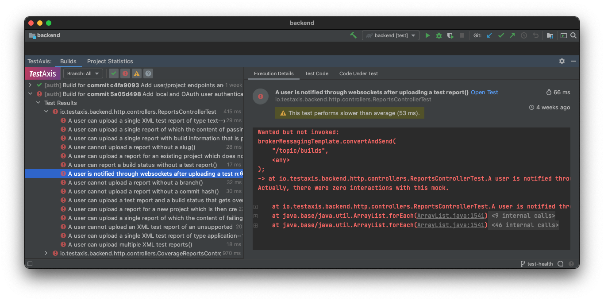
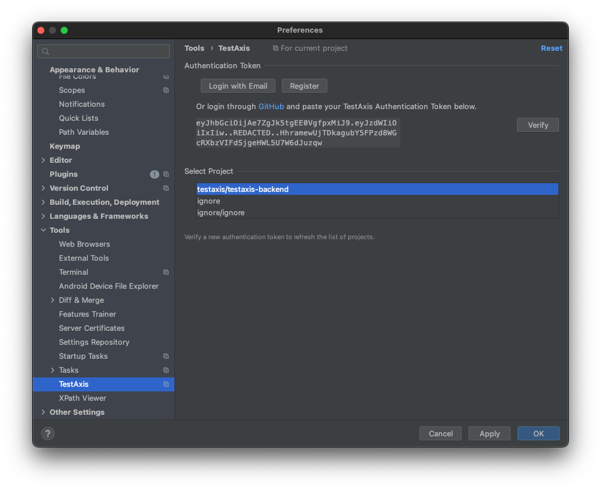
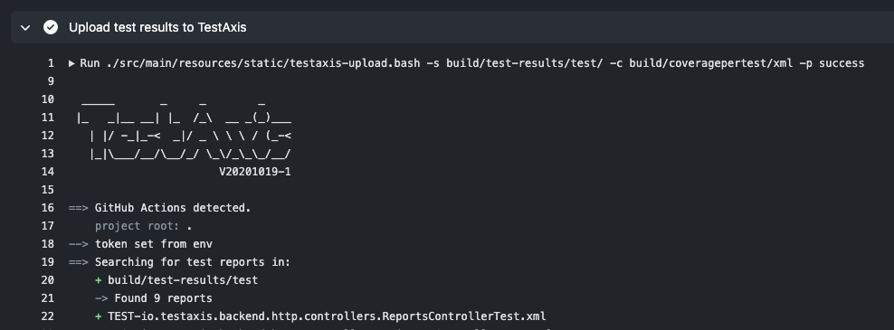

<p align="center">
    
    <br />
</p>

<h1 align="center">
    TestAxis: IntelliJ Plugin
</h1>

<p align="center">
    <a href="https://github.com/testaxis/testaxis-intellij-plugin/actions?query=workflow%3ABuild">
        
    </a>
    <a href="https://plugins.jetbrains.com/plugin/PLUGIN_ID">
        
    </a>
    <a href="https://plugins.jetbrains.com/plugin/PLUGIN_ID">
        
    </a>
</p>

The IDE plugin of TestAxis shows details and context of tests executed during CI runs.



## What is TestAxis?

<!-- Plugin description -->
Commonly used CI platforms such as GitHub Actions or Travis CI let developers dive through hundreds of lines of logs to find the issue of a failing build.
It turns out that the most important reason for a failing build is failing tests.
Developers can be helped by showing a detailed overview of the tests that failed after a CI run that does not require looking at log files.
The names and error messages of the failing tests are shown in this overview to obviate the need to look at log files.

However, even when the failing test is found, it is sometimes hard to identify the exact reason for the failure based on the test name/error message without additional context.
This could be because the reason for failure is not necessarily related to the concept under test which is reflected in the test name, which could especially be the case since during local development a developer might only run tests that are obviously related to the code change, whereas during a CI build a test with a less obvious connection might fail.
The error message might be too imprecise to judge what is going wrong.
For example, a failure message like “Failed asserting that 24 is equal to 15” may not be informative enough for the developer to come up with the fix.

Thus, additional context is needed to find the issue causing the test to fail.
Therefore, developers could be helped by providing “test context” in the detailed overview of failed tests.
The test context may include additional information such as the commit that made the test fail, the test code, and the _changed_ code under test.
The goal is to give developers insights into failing tests after CI builds and to provide them with information that helps to resolve the issues causing the failing tests faster.
The insights are provided directly in the IDE, right there where the developer needs to fix the failing tests.
The information presented to the user is based on historical test executions with the goal to shift the axis from builds to tests.
<!-- Plugin description end -->

## Usage

### Installation

- [coming soon] Using IDE built-in plugin system:
  
  <kbd>Preferences</kbd> > <kbd>Plugins</kbd> > <kbd>Marketplace</kbd> > <kbd>Search for "testaxis-intellij-plugin"</kbd> >
  <kbd>Install Plugin</kbd>
  
- Manually:

  Download the [latest release](https://github.com/testaxis/testaxis-intellij-plugin/releases/latest) and install it manually using
  <kbd>Preferences</kbd> > <kbd>Plugins</kbd> > <kbd>⚙️</kbd> > <kbd>Install plugin from disk...</kbd>

See [testaxis.io](https://testaxis.io) for instructions on how to set up TestAxis for your CI service.

### Set Up

#### Plugin

* Go to the TestAxis settings:
  
  <kbd>Preferences</kbd> > <kbd>Tools</kbd> > <kbd>TestAxis</kbd>
  
  
* Log in using GitHub or use/create a TestAxis account.
  If you use GitHub, your TestAxis token will be shown in your browser.
  Copy this code to the settings as instructed.
  
* Click <kbd>Verify</kbd> to ensure you are logged in correctly.

* Select your project on TestAxis corresponding to your currently active project in IntelliJ.
  _For a project to show up in the list, the first reports need to be uploaded to TestAxis, see below._

#### CI Service

Information about your test executions need to be uploaded as a part of your CI build process.
Below, instructions are provided for use with GitHub Actions.
However, other CI services can be set up similarly.
Make sure that the upload script gets always executed, even if the tests fail in earlier step.

The instructions below specify the paths for usage with Gradle.
If you do not use Gradle in your project, you have to customize the paths.
Furthermore, if you are a Gradle user and want to enable the "code under test" feature, you need to set up the
[coverage-per-test Gradle plugin](https://github.com/testaxis/coverage-per-test-gradle-plugin).

The following build step can be added to your GitHub Actions workflow.
```yaml
- name: Upload test results to TestAxis
  run: bash <(curl -s https://testaxis.io/testaxis-upload.bash) -s build/test-results/test/ -c build/coveragepertest/xml -p ${{ job.status }}
  if: always()
  env:
    TESTAXIS_TOKEN: ${{ secrets.TESTAXIS_TOKEN }}
```

The `TESTAXIS_TOKEN` can be provided as an environment variable.
You can find this token in the settings of the IDE plugin, see above.
The token can be added as an action secret on the settings page of your repository 
(<kbd>Settings</kbd> > <kbd>Secrets</kbd>).

In the next CI run, you will now see the new build step:


The project should now be available in the IDE settings.
See the plugin instructions above on how to select the project.

## Development

Run an IntelliJ instance with the plugin enabled:
```bash
$ gradlew runIde
```

Run the tests and static analysis tools:
```
$ gradlew check
```

## Security

If you discover any security related issues, please email mail@casperboone.nl instead of using the issue tracker.

## Credits

- [Casper Boone](https://github.com/casperboone)
- [All Contributors](../../contributors)

## License

The MIT License (MIT). Please see [License File](LICENSE.md) for more information.
